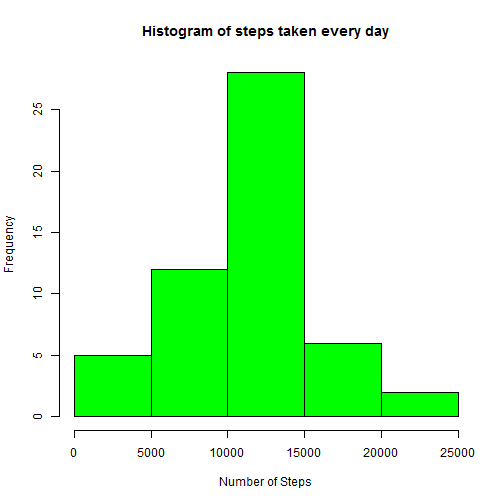
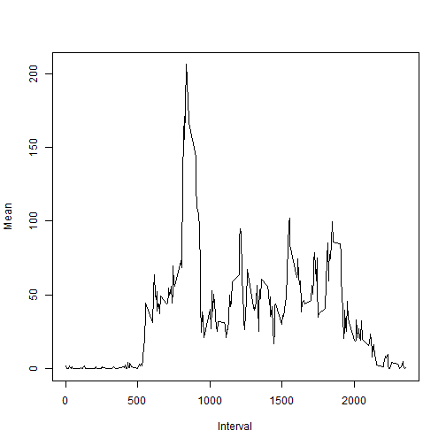
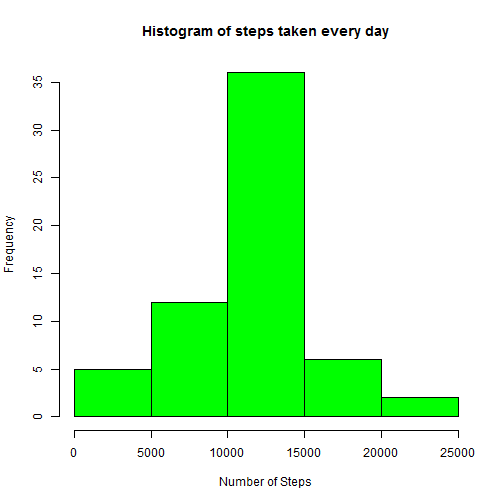
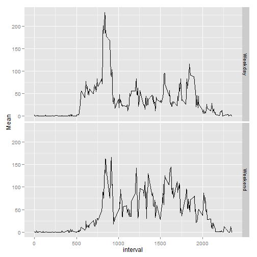

# Reproducible Research Peer Assignment-1

## Part 1(mean total number of steps taken per day):

```r
library(graphics)
library(plyr)
##importing data:
data<-read.csv("./data/activity.csv")
summary(data)
```

```
##      steps               date          interval   
##  Min.   :  0.0   2012-10-01:  288   Min.   :   0  
##  1st Qu.:  0.0   2012-10-02:  288   1st Qu.: 589  
##  Median :  0.0   2012-10-03:  288   Median :1178  
##  Mean   : 37.4   2012-10-04:  288   Mean   :1178  
##  3rd Qu.: 12.0   2012-10-05:  288   3rd Qu.:1766  
##  Max.   :806.0   2012-10-06:  288   Max.   :2355  
##  NA's   :2304    (Other)   :15840
```

```r
NumberofNA=sum(is.na(data))

##taking sum:
data2<-ddply(data,.(date),summarise, Total=sum(steps))

hist(data2$Total,breaks=7,col="GREEN",main="Histogram of steps taken every day",xlab = "Number of Steps")
```

 

```r
##MEDIAN OF THE DATA EXCLUDING THE NA:
median(data2$Total,na.rm=TRUE)
```

```
## [1] 10765
```

```r
##MEAN OF THE DATA EXCLUDING THE NA:
mean(data2$Total,na.rm=TRUE)
```

```
## [1] 10766
```


# Part 2(Average Daily Activity Pattern):

```r
data3<- ddply(data,.(interval),summarise,Mean = mean(steps,na.rm=TRUE))
plot(data3$interval,data3$Mean,type='l',xlab="Interval",ylab="Mean")
```

 

```r
max<-max(data3$Mean)
maxInterval<-data3[data3$Mean==max,]$interval
```
The 5 minute interval which contains the maximum number of steps taken: 835 and the max is:206.1698. The max interval can be interpreted as the time between 8:30-8:35.


# Part 3(Imputing missing values)

```r
##Replacing the NA values with the relavent Mean.
data[is.na(data$steps),]$steps = data3$Mean
##There are no NA values after replacing NA's.
summary(data)
```

```
##      steps               date          interval   
##  Min.   :  0.0   2012-10-01:  288   Min.   :   0  
##  1st Qu.:  0.0   2012-10-02:  288   1st Qu.: 589  
##  Median :  0.0   2012-10-03:  288   Median :1178  
##  Mean   : 37.4   2012-10-04:  288   Mean   :1178  
##  3rd Qu.: 27.0   2012-10-05:  288   3rd Qu.:1766  
##  Max.   :806.0   2012-10-06:  288   Max.   :2355  
##                  (Other)   :15840
```

```r
data2<-ddply(data,.(date),summarise, Total=sum(steps))
hist(data2$Total,breaks=7,col="GREEN",main="Histogram of steps taken every day",xlab = "Number of Steps")
```

 

```r
median(data2$Total)
```

```
## [1] 10766
```

```r
mean(data2$Total)
```

```
## [1] 10766
```
The difference in mean and median due to imputing is pretty less and the number of NA values were 2304 before imputing.

#Part 4(differences in activity patterns between weekdays and weekends)


```r
day<-weekdays(as.Date(data$date))
data<-cbind(data,day)
head(data)
```

```
##     steps       date interval    day
## 1 1.71698 2012-10-01        0 Monday
## 2 0.33962 2012-10-01        5 Monday
## 3 0.13208 2012-10-01       10 Monday
## 4 0.15094 2012-10-01       15 Monday
## 5 0.07547 2012-10-01       20 Monday
## 6 2.09434 2012-10-01       25 Monday
```

```r
##Construction of the factor:
x <-data$day
x<-as.character(x)
x[x == "Friday"|x== "Tuesday"|x== "Wednesday"|x== "Thursday"|x== "Monday"] <- "Weekday"
x[x=="Saturday"|x== "Sunday"] = "Weekend"
x<-as.factor(x)
weekFactor<-x
is.factor(weekFactor)
```

```
## [1] TRUE
```

```r
data<-cbind(data,weekFactor)
#indicating whether the day is a weekday or a weekend:
head(data)
```

```
##     steps       date interval    day weekFactor
## 1 1.71698 2012-10-01        0 Monday    Weekday
## 2 0.33962 2012-10-01        5 Monday    Weekday
## 3 0.13208 2012-10-01       10 Monday    Weekday
## 4 0.15094 2012-10-01       15 Monday    Weekday
## 5 0.07547 2012-10-01       20 Monday    Weekday
## 6 2.09434 2012-10-01       25 Monday    Weekday
```

```r
tail(data)
```

```
##        steps       date interval    day weekFactor
## 17563 2.6038 2012-11-30     2330 Friday    Weekday
## 17564 4.6981 2012-11-30     2335 Friday    Weekday
## 17565 3.3019 2012-11-30     2340 Friday    Weekday
## 17566 0.6415 2012-11-30     2345 Friday    Weekday
## 17567 0.2264 2012-11-30     2350 Friday    Weekday
## 17568 1.0755 2012-11-30     2355 Friday    Weekday
```

```r
data5<-ddply(data,.(interval,weekFactor),summarise,Mean = mean(steps))

library(ggplot2)
qplot(interval,Mean,data=data5,facets=weekFactor~.,geom="line")
```

 


